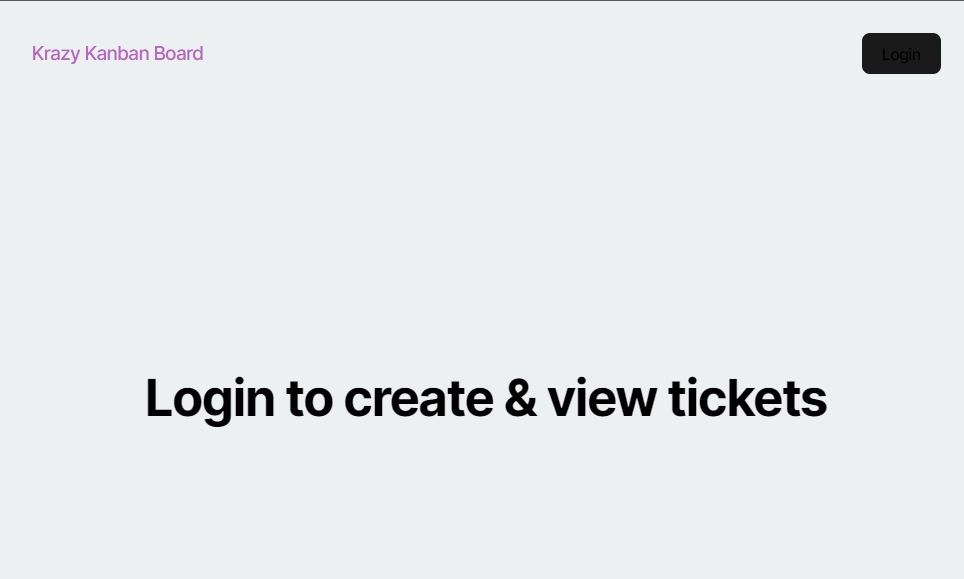
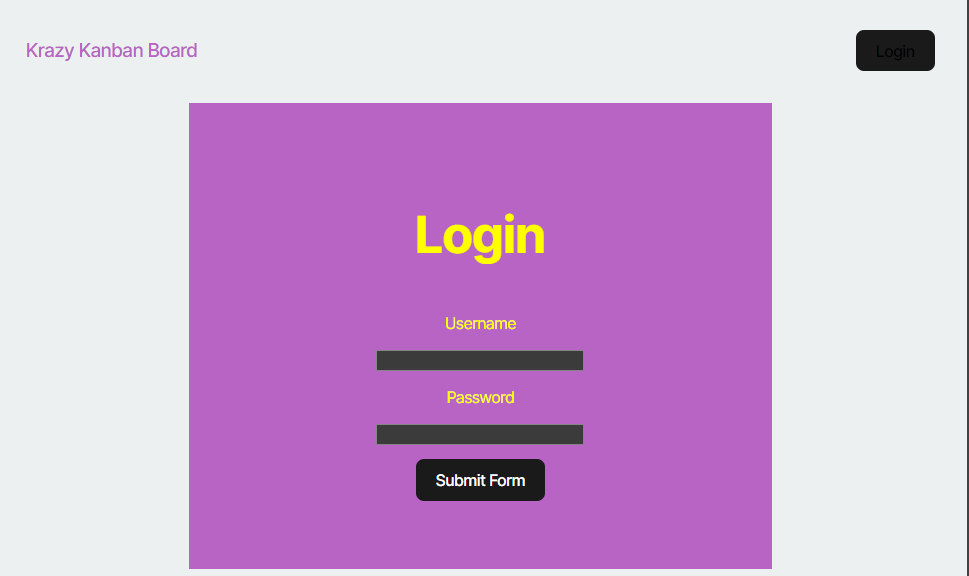

# Krazy Kanban Board

**Krazy Kanban Board** is a full-stack web application that allows users to manage and track tasks using a kanban board system. Users can create, view, and organize tasks (tickets) into different swimlanes to visualize their workflow. The application features user authentication, ensuring that only logged-in users can access and modify their tasks.

## Features
- **User registration and login with JWT authentication.**
- **Kanban board interface with columns (swimlanes) representing task states.**
- **Ability to create new tasks, move tasks between swimlanes, and delete tasks.**
- **Responsive design to provide an optimal user experience across devices.**
- **Frontend built with React and React Router for navigation.**
- **Backend powered by Express and Sequelize for database management.**

## Table of Contents
- [Features](#features)
- [Technologies](#technologies)
- [Installation](#installation)
    - [Environment Variables](#environment-variables)
- [Usage](#usage)
- [Backend API Endpoints](#backend-api-endpoints)
- [Frontend Structure](#frontend-structure)
- [Screenshots](#screenshots)
- [License](#license)

## Technologies

### Frontend:
- **React** (for building the user interface)
- **React Router** (for client-side routing)
- **TypeScript** (for type safety)
- **CSS** (for styling)

### Backend:
- **Node.js** (runtime environment)
- **Express** (backend framework)
- **Sequelize** (ORM for interacting with PostgreSQL)
- **JWT** (for user authentication)
- **bcrypt** (for password hashing)

### Database:
- **PostgreSQL** (relational database)

## Installation

### Prerequisites:
- **Node.js**
- **PostgreSQL**

### Steps:

1. **Clone the repository**:
```bash
git clone https://github.com/your-repo/kanban-board.git
cd kanban-board
```

2. Install dependencies:

```bash
npm install
```

3. Set up the database:

- Ensure that PostgreSQL is running and a database is created (e.g., kanban_db).

- Create a .env file in the server directory to configure your environment variables.

### Environment Variables
Create a .env file in the server directory and add the following values:

    ```env
    JWT_SECRET_KEY=your_secret_key_here
    DB_NAME=kanban_db
    DB_USER=your_db_user
    DB_PASSWORD=your_db_password
    ```

## Usage
### Running the Application

1. Seed the database (optional)

```bash
npm run seed
```

2. Start the application:

```bash
npm run start
```

### Accessing the Application
Open a browser and visit http://localhost:3001 to access the application.

## Backend API Endpoints
### Authentication:
- POST /auth/login - Logs in a user and returns a JWT token.

### Tickets:

- GET /api/tickets - Fetches all tickets.
- POST /api/tickets - Creates a new ticket (requires authentication).

- PUT /api/tickets/:id - Updates a ticket (requires authentication).

- DELETE /api/tickets/:id - Deletes a ticket (requires authentication).

## Frontend Structure
- ```Navbar.tsx```: Handles navigation and login/logout functionality.

- ```Login.tsx```: The login page that uses JWT authentication.

- ```Board.tsx```: The kanban board where users can create, view, and manage tasks.

- ```Swimlane.tsx```: Component to display tickets in different states.

### Example Usage Flow:
1. Login: Navigate to /login, input credentials, and log in.

2. View Board: Upon successful login, the kanban board is displayed, allowing you to create or view tasks.

3. Create Ticket: Click the "New Ticket" button to create a task.

4. Logout: The user can log out, which will redirect to the home page.

## Screenshots

**Home Page**


**Login Page**


**Kanban Board**


## License
This project is licensed under the MIT License.

## Questions
For any inquiries or issues, please contact:

- Name: Owen Kenne
- Email: <okenne.devworks@gmail.com>
- GitHub: [O-KenneDevWorks](https://github.com/O-KenneDevWorks/)